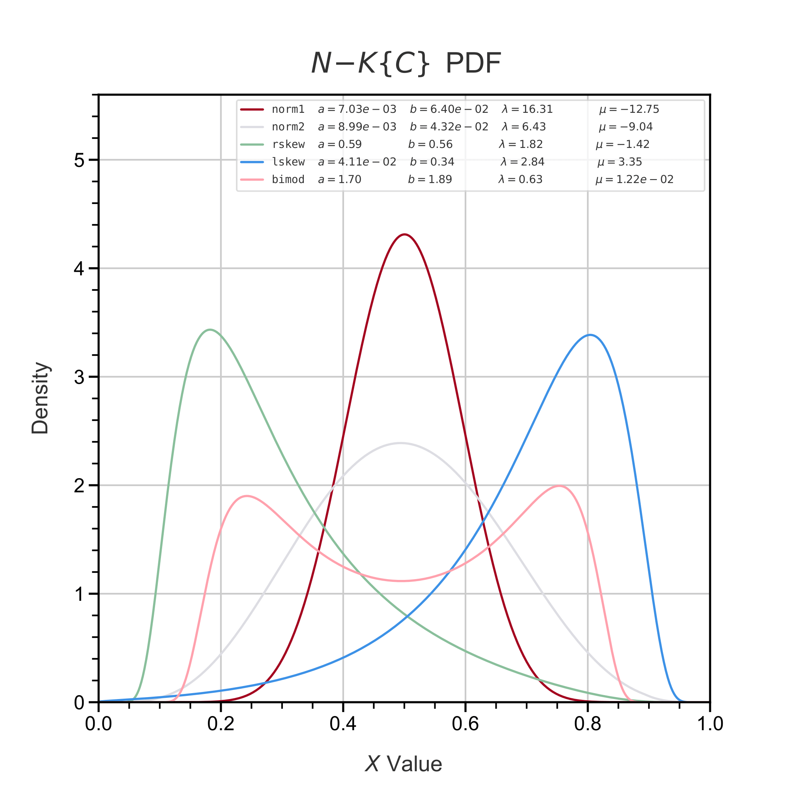
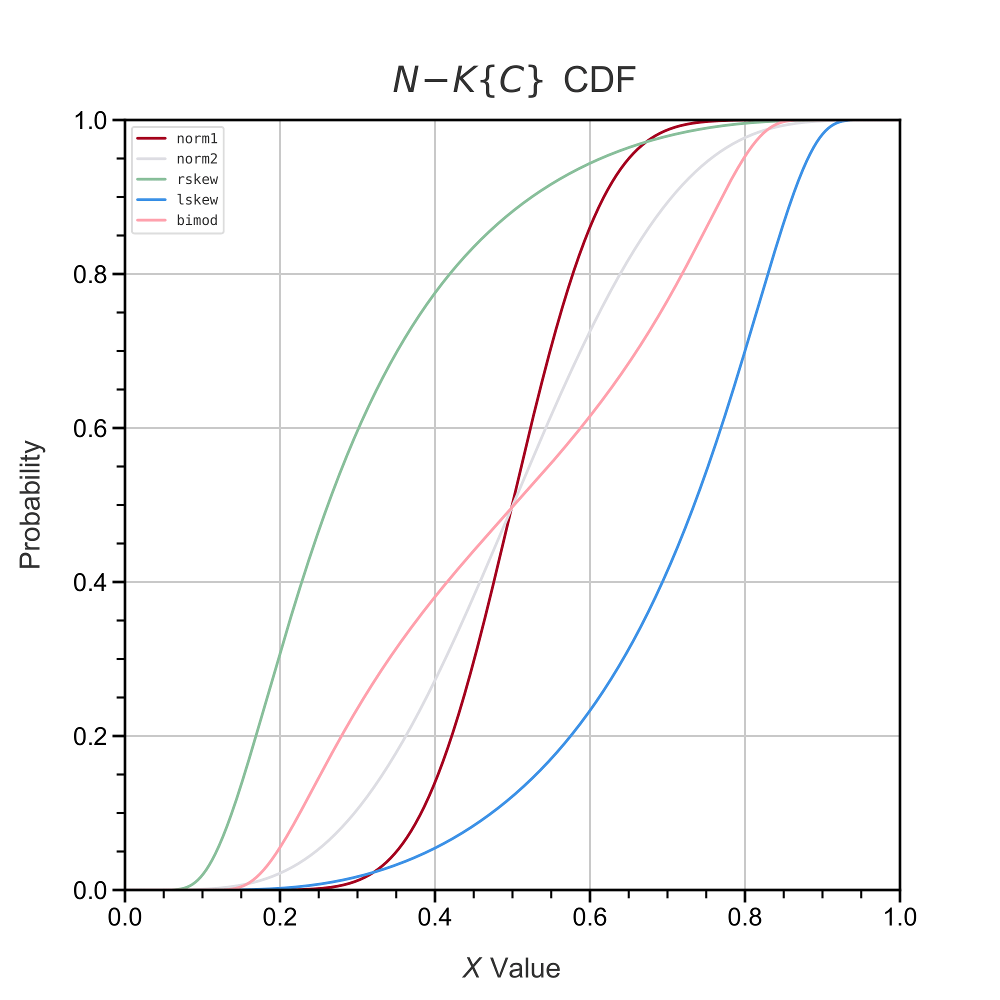
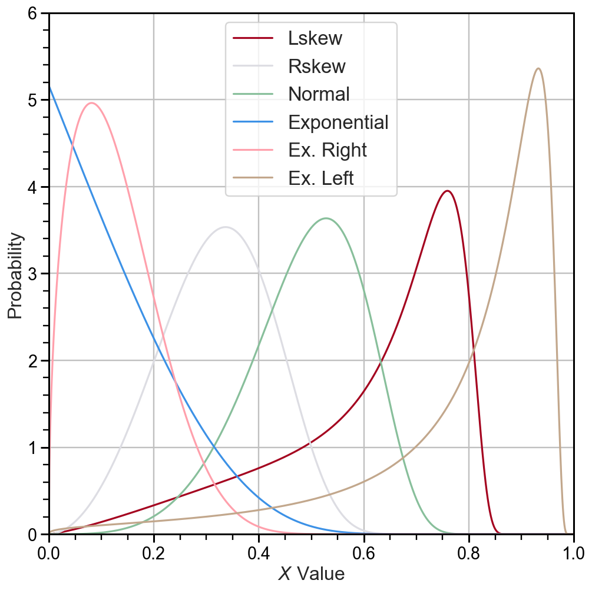
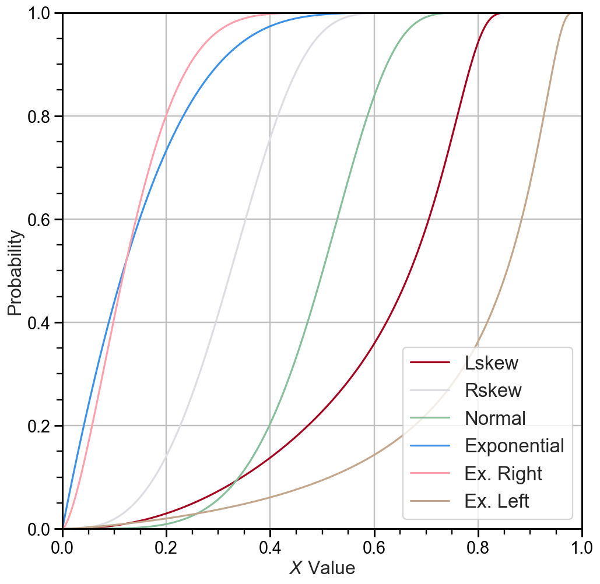

<h1 align='center'>
  INBRE Summer Research 2025
</h1>

  
  
  
  

## Abstract

Generic distributions often specialize in specific shapes. For fields with experiment outcomes that are often fluctuating, these distributions are greatly limited in what they can model about such data.
In response, the goal of this research is to define a flexible distribution that can represent a variety of trends in data without overfitting.
This is achieved through following the T-R{Y} Framework, which defines three random variables T, R and Y, that all follow their own specified distributions composited to create a new distribution.
The composition of these distributions, often referred to as generations, allow each one to pass on their parameters and properties to the next, establishing a new distribution with the power of all three.
Using this framework,the N-K{C} and W-K{LL} are defined, and arise from the Kumaraswamy distribution and other distributions to capture symmetric curves, bimodality, left skewness, and right skewness.
These models are fitted to data using differential evolution and evaluated using AIC and BIC values. Comparisons with generic distributions demonstrate the increased flexibility of the framework-based models.

## Application
#### Click badge to see the demo of one of the new distributions we made!

  

#### PDF & CDF of the N-K{C} Distribution

|  |  |
|-----------------------------|-----------------------------|

#### PDF & CDF of the W-K{LL} Distribution

|  |  |
|-----------------------------|-----------------------------|

## Contributors

| Name                      | winthrop.edu                                                           | Github                                    |
|---------------------------|------------------------------------------------------------------------|-------------------------------------------|
| Steven Stokes             |                                                                        | [Link ↗](https://github.com/Steven-S1020) |
| Miguel Villano            |                                                                        | [Link ↗](MiguelVillano)                   |
| Gihanee Senadheera, Ph.D. | [Link ↗](https://www.winthrop.edu/cas/faculty/senadheera-gihanee.aspx) |                                           |

## References
- [T-normal family of distributions: a new approach to generalize the normal distribution (2014)](https://doi.org/10.1186/2195-5832-1-16), Alzaatreh, Lee, and Famoye  
- [A New Generalization of the Continuous Bernoulli Distribution (2025)](https://preview.scholarlattice.org/submissions/905a70c2-83a5-46e5-8c48-ed7a8dfeaf30), Nix and Robenolt  
- [A Unified Differential Evolution Algorithm for Global Optimization (2014)](https://www.osti.gov/biblio/1163659), Qiang and Mitchell  
- [A New Family of Generalized Distributions on the Unit Interval: The T–Kumaraswamy Family of Distributions (2022)](https://doi.org/10.6339/JDS.202004_18(2).0001), Osatohanmwen et al.  

## Acknowledgements
Research reported in this publication was supported by the National Institute of General Medical Sciences of the National Institutes of Health under Award Number P20GM103499.
The content is solely the responsibility of the authors and does not necessarily represent the official views of the National Institutes of Health
